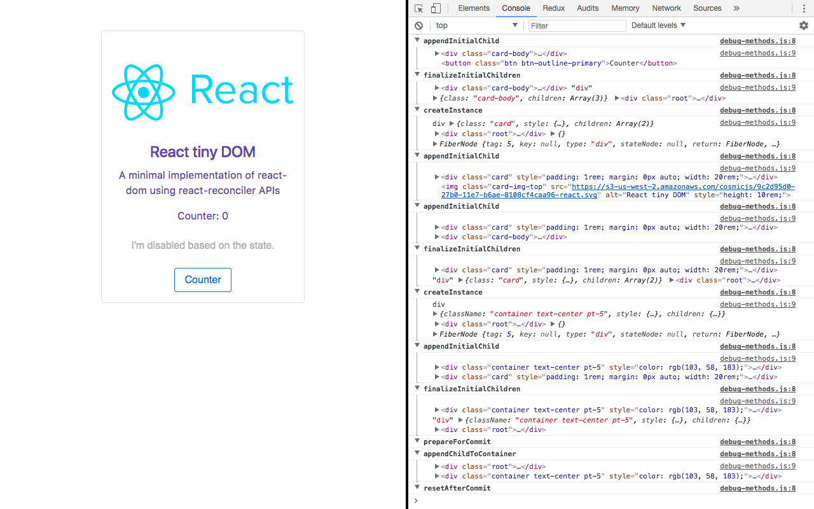

# react-tiny-dom

`react-tiny-dom` is a minimal implementation of [react-dom](https://reactjs.org/docs/react-dom.html) as custom renderer using React 16 official Renderer API.

The purpose of this project is to show the meaning of each method of the `ReconcilerConfig` passed to [react-reconciler](https://github.com/facebook/react/tree/master/packages/react-reconciler), by using a practical yet familiar environment: the browser DOM.



## What's supported

- Nested React components
- `setState` updates
- Text nodes
- HTML Attributes
- Event listeners
- `className` prop
- `style` prop

## What's not supported yet, but I plan to

The following features of `react-dom` are not supported yet but I'll probably add them:

- Web Components

Any other feature which doesn't help explaining the `Renderer API`, like `dangerouslySetInnerHTML`, won't be supported on purpose, to keep the source code minimal and focused on simplicity.

## Installation

```
npm install
npm start # Runs the example using react-tiny-dom
```

## FAQ

### How can I customize the methods logs in the console?

By default the demo logs most method calls of the Renderer, but you can pass a list of method names to exclude in the second parameter of `debugMethods`, when passing the `ReconcilerConfig` to `Reconciler`.

```js
const TinyDOMRenderer = Reconciler(
  debugMethods(hostConfig, ['now', 'getChildHostContext', 'shouldSetTextContent'])
);
```

Obviously passing `hostConfig` directly to `Reconciler` will completely disable any method log.
